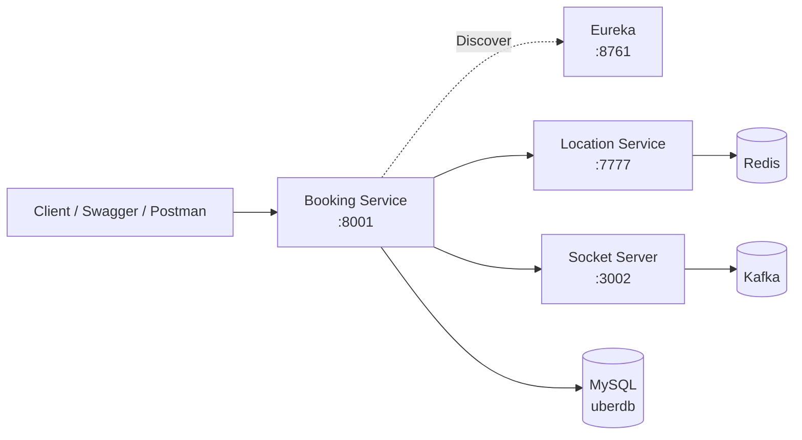
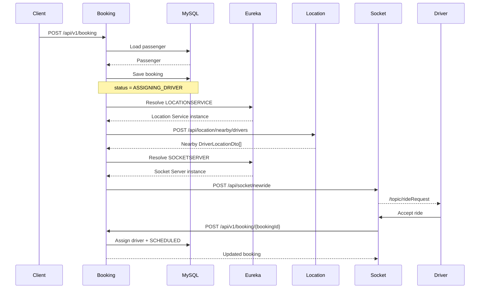

# RideFlow Booking Service

RideFlow Booking Service orchestrates the distributed ride-booking workflow.

Its job is not only to persist a booking. It also coordinates with other RideFlow services to begin driver discovery and real-time ride dispatch.

The current flow is:

```text id="bkmf1h"
Passenger creates booking
        ↓
Booking persisted
        ↓
Location Service finds nearby drivers
        ↓
Socket Server receives ride request
        ↓
Drivers receive WebSocket notification
        ↓
Driver accepts ride
        ↓
Booking gets assigned to driver
```

---

## Runtime

| Property              | Value                 |
| --------------------- | --------------------- |
| Application           | `BookingService`      |
| Port                  | `8001`                |
| Database              | MySQL / `uberdb`      |
| Service Discovery     | Netflix Eureka Client |
| Inter-Service HTTP    | Retrofit              |
| Redis                 | Configured            |
| Kafka                 | Configured            |
| Shared Entity Version | `0.0.7-SNAPSHOT`      |
| API Documentation     | Springdoc OpenAPI     |

---

## What This Service Implements

* ride booking creation
* passenger lookup
* start/end location persistence
* initial booking status management
* nearby-driver lookup through Location Service
* Socket Server notification
* Eureka-based service discovery
* driver assignment
* booking update
* Swagger/OpenAPI documentation
* asynchronous Retrofit callbacks

---

## High-Level Architecture



---

## Distributed Booking Flow



---

## Swagger / OpenAPI

Swagger UI:

```text id="iz005h"
http://localhost:8001/swagger-ui.html
```

OpenAPI JSON:

```text id="w5h7wk"
http://localhost:8001/v3/api-docs
```

OpenAPI YAML:

```text id="xrt36w"
http://localhost:8001/v3/api-docs.yaml
```

Swagger currently documents:

```text id="sn1q0s"
/api/v1/booking/**
```

Springdoc may redirect:

```text id="nmk67r"
/swagger-ui.html
```

to:

```text id="0ef5cn"
/swagger-ui/index.html
```

---

## API Base Path

```text id="gklnas"
/api/v1/booking
```

Current APIs:

| Method | Endpoint                      | Purpose                                    |
| ------ | ----------------------------- | ------------------------------------------ |
| POST   | `/api/v1/booking`             | Create a booking and start driver dispatch |
| POST   | `/api/v1/booking/{bookingId}` | Assign a driver/update booking             |

---

# 1. Create Booking

Endpoint:

```http id="mcd3tf"
POST /api/v1/booking
```

A booking request contains:

* passenger ID
* pickup coordinates
* destination coordinates

Example request:

```json id="8zybhz"
{
  "passengerId": 1,
  "startLocation": {
    "latitude": 17.385,
    "longitude": 78.4867
  },
  "endLocation": {
    "latitude": 17.4435,
    "longitude": 78.3772
  }
}
```

---

## Booking Creation Flow

Internally:

```text id="ejdnu7"
CreateBookingRequest
        ↓
Load Passenger
        ↓
Create Booking Entity
        ↓
status = ASSIGNING_DRIVER
        ↓
Save Start Location
        ↓
Save End Location
        ↓
Persist Booking
        ↓
Return Booking Response
        ↓
Continue Nearby Driver Search Asynchronously
```

---

## Initial Booking Status

A newly created distributed booking starts with:

```text id="aqhpbe"
ASSIGNING_DRIVER
```

This means:

```text id="kwhs69"
Booking exists
+
Ride dispatch has started
+
Driver has not yet been assigned
```

---

## Important Meaning of `201 Created`

The API can return:

```text id="bx6uhk"
201 Created
```

before the distributed driver-dispatch workflow finishes.

The response means:

```text id="niy0v7"
Booking was successfully persisted
+
Asynchronous driver discovery was initiated
```

It does **not** mean:

```text id="svlzpj"
A nearby driver was found
Driver received WebSocket request
Driver accepted ride
Booking became SCHEDULED
```

Those operations happen afterward through asynchronous service calls.

---

## Example Response

A response can conceptually look like:

```json id="26g26w"
{
  "id": 19,
  "startTime": null,
  "endTime": null,
  "totalDistance": 0,
  "bookingStatus": "ASSIGNING_DRIVER",
  "driver": null,
  "passenger": {
    "id": 1,
    "passengerName": "Anita S. Sharma"
  },
  "review": null
}
```

---

# 2. Find Nearby Drivers

After persistence, Booking Service extracts pickup coordinates:

```text id="ddxch2"
startLocation.latitude
startLocation.longitude
```

and calls Location Service.

Endpoint:

```text id="vsu6vd"
POST /api/location/nearby/drivers
```

The Retrofit client expects:

```text id="c5mjd0"
DriverLocationDto[]
```

---

## Location Service Discovery

Booking Service does not need to hardcode:

```text id="n2up8p"
http://localhost:7777
```

for the distributed location call.

Instead, it discovers:

```text id="ez50x3"
LOCATIONSERVICE
```

through Eureka.

Flow:

```text id="kslmjs"
Booking Service
      ↓
Ask Eureka for LOCATIONSERVICE
      ↓
Receive service instance
      ↓
Create Retrofit request
      ↓
Call nearby-driver endpoint
```

---

## Nearby Driver Request

Conceptually:

```json id="inw1it"
{
  "latitude": 17.385,
  "longitude": 78.4867
}
```

Example Location Service response:

```json id="lnwzcv"
[
  {
    "driverId": "1",
    "latitude": 17.385,
    "longitude": 78.4867
  },
  {
    "driverId": "2",
    "latitude": 17.39,
    "longitude": 78.49
  }
]
```

---

# 3. Notify Socket Server

After Location Service responds successfully, Booking Service calls Socket Server.

Endpoint:

```text id="hexbod"
POST /api/socket/newride
```

Socket Server is discovered through:

```text id="kpp7pr"
SOCKETSERVER
```

using Eureka.

---

## Socket Request

A ride-request DTO contains fields such as:

```json id="4vrnqi"
{
  "passengerId": 1,
  "bookingId": 19,
  "driverIds": []
}
```

---

## Current Nearby Driver Limitation

Booking Service currently receives nearby-driver information from Location Service.

However, the current implementation does not populate the returned driver IDs into:

```text id="4jb0b9"
RideRequestDto.driverIds
```

before sending the request to Socket Server.

So currently:

```text id="1rtx14"
Location Service finds nearby drivers
        ↓
Booking Service receives results
        ↓
Results are logged
        ↓
Socket request created
        ↓
Nearby driver IDs are not copied
```

This is an important future improvement.

---

# 4. Driver Assignment

Once a driver accepts a ride through Socket Server, Socket Server calls Booking Service.

Endpoint:

```http id="vyjq1j"
POST /api/v1/booking/{bookingId}
```

Example:

```text id="hca9m9"
POST /api/v1/booking/19
```

Example request:

```json id="wuezyj"
{
  "driverId": 1,
  "status": "SCHEDULED"
}
```

---

## Current Driver Assignment Logic

The current implementation:

```text id="yio861"
Booking ID
   +
Driver ID
      ↓
Load Driver
      ↓
Update Booking
      ↓
Assign Driver
      ↓
Set bookingStatus = SCHEDULED
```

The booking status is currently forced to:

```text id="ivmrvw"
SCHEDULED
```

during this operation.

---

## Example Updated Booking

```json id="40hpwg"
{
  "id": 19,
  "startTime": null,
  "endTime": null,
  "totalDistance": 0,
  "bookingStatus": "SCHEDULED",
  "driver": {
    "id": 1,
    "driverName": "Ravi K. Kumar"
  },
  "passenger": {
    "id": 1,
    "passengerName": "Anita S. Sharma"
  },
  "review": null
}
```

The current response maps the assigned driver into a lightweight driver summary instead of returning the complete JPA entity graph.

---

## Eureka Configuration

Application name:

```properties id="ui20gd"
spring.application.name=BookingService
```

Port:

```properties id="3j6geu"
server.port=8001
```

Eureka:

```properties id="z4wo5v"
eureka.client.service-url.defaultZone=http://localhost:8761/eureka
eureka.instance.preferIpAddress=true
```

After startup, open:

```text id="7ba2dt"
http://localhost:8761
```

and verify:

```text id="4iafpg"
BOOKINGSERVICE
```

is registered.

---

## Database Configuration

Booking Service uses MySQL:

```properties id="s97qs0"
spring.datasource.url=jdbc:mysql://localhost:3306/uberdb
spring.datasource.username=root
spring.datasource.password=root
```

Hibernate:

```properties id="pwyuoc"
spring.jpa.hibernate.ddl-auto=update
spring.jpa.show-sql=true
```

Create the local database when needed:

```sql id="5z43r2"
CREATE DATABASE uberdb;
```

Production credentials should be externalized.

---

## Redis Configuration

Booking Service includes Redis support.

Typical configuration:

```properties id="l708ln"
spring.data.redis.host=localhost
spring.data.redis.port=6379
```

The active nearby-driver GEO operations themselves are performed by Location Service.

---

## Kafka Configuration

Kafka broker:

```properties id="oy0fr9"
spring.kafka.bootstrap-servers=localhost:9092
```

Consumer group:

```text id="pqcwun"
sample-group-2
```

Kafka is part of the wider RideFlow messaging setup, while the current booking dispatch primarily uses Retrofit + Socket Server.

---

## Retrofit

Booking Service uses Retrofit for inter-service HTTP communication.

Important API clients include:

```text id="q0e6j8"
LocationServiceApi
UberSocketApi
```

### Location Service Contract

```text id="oe1dom"
POST /api/location/nearby/drivers
```

### Socket Server Contract

```text id="swkywc"
POST /api/socket/newride
```

---

## Technology Stack

* Java 17
* Spring Boot 4.1.1
* Spring MVC
* Spring Data JPA
* Hibernate
* MySQL
* Redis
* Apache Kafka
* Netflix Eureka Client
* Retrofit
* OkHttp
* Gson
* Springdoc OpenAPI
* Lombok
* Gradle
* RideFlow EntityService

---

## Shared Entity Dependency

Current version:

```gradle id="reljbj"
implementation 'com.rideflow:Rideflow-EntityService:0.0.7-SNAPSHOT'
```

EntityService is resolved using Maven Local.

Before running Booking Service:

### Windows

```bash id="u8clnb"
cd Rideflow-EntityService
gradlew.bat publishToMavenLocal
```

### Linux / macOS

```bash id="qgmalr"
cd Rideflow-EntityService
./gradlew publishToMavenLocal
```

---

## Prerequisites

For the complete booking flow, run:

* JDK 17+
* MySQL
* Redis
* Kafka
* RideFlow EntityService
* Service Discovery
* Location Service
* Socket Server

A passenger and driver should also exist in the shared development database for realistic testing.

---

## Recommended Startup Order

```text id="nc9jf7"
1. MySQL
2. Redis
3. Kafka
4. Publish EntityService
5. Service Discovery
6. Location Service
7. Socket Server
8. Booking Service
```

---

## Running the Application

### Windows

```bash id="re468y"
gradlew.bat bootRun
```

### Linux / macOS

```bash id="9ywglz"
./gradlew bootRun
```

Application:

```text id="c8rtxl"
http://localhost:8001
```

Swagger:

```text id="eq0ifx"
http://localhost:8001/swagger-ui.html
```

---

## Testing With Swagger

Open:

```text id="wke2ps"
http://localhost:8001/swagger-ui.html
```

Before calling the API, confirm:

```text id="r0m90r"
MySQL      → running
Redis      → running
Kafka      → running
Eureka     → running
Location   → registered
Socket     → registered
Booking    → registered
Passenger  → exists
Driver     → exists
```

---

## Recommended End-to-End Test

### Step 1 — Check Eureka

Open:

```text id="j2vs8p"
http://localhost:8761
```

Confirm:

```text id="w4fo13"
LOCATIONSERVICE
SOCKETSERVER
BOOKINGSERVICE
```

---

### Step 2 — Store a Driver Location

Call Location Service:

```text id="b60ygq"
POST http://localhost:7777/api/location/drivers
```

Example:

```json id="lmw4ya"
{
  "driverId": "1",
  "latitude": 17.385,
  "longitude": 78.4867
}
```

---

### Step 3 — Create Booking

Use Booking Swagger:

```text id="6iwjzo"
http://localhost:8001/swagger-ui.html
```

Call:

```text id="ak7p85"
POST /api/v1/booking
```

---

### Step 4 — Check Booking Response

Initially expect:

```text id="dg0eha"
ASSIGNING_DRIVER
```

The driver may initially be:

```json id="ntntmf"
null
```

because assignment happens afterward.

---

### Step 5 — Observe Socket Dispatch

Connected driver clients should receive:

```text id="zipfq7"
/topic/rideRequest
```

from Socket Server.

---

### Step 6 — Driver Accepts

Driver responds through:

```text id="or6blc"
/app/rideResponse/{driverId}
```

Socket Server then calls Booking Service.

---

### Step 7 — Booking Becomes Scheduled

Expected status:

```text id="ftxkkn"
SCHEDULED
```

with a driver summary attached.

---

## Project Structure

```text id="4asyqm"
src/main/java/
└── ...
    ├── api/
    │   ├── LocationServiceApi.java
    │   └── UberSocketApi.java
    ├── configuration/
    │   ├── OpenApiConfig.java
    │   └── RetrofitConfig.java
    ├── controller/
    │   └── BookingController.java
    ├── dto/
    ├── repository/
    ├── service/
    │   ├── BookingService.java
    │   └── BookingServiceImpl.java
    └── BookingServiceApplication.java
```

---

## Current Implementation Notes

### Passenger Lookup

Current booking creation relies on:

```text id="mm2sej"
Optional.get()
```

after passenger lookup.

A stronger implementation should convert missing passengers into a domain exception such as:

```text id="2ocnn9"
PassengerNotFoundException
```

instead of allowing a generic `NoSuchElementException`.

---

### Async Retrofit Calls

Location Service and Socket Server calls occur asynchronously.

Therefore failures after the booking is saved do not automatically rollback the original booking.

For example:

```text id="seambh"
Booking saved
     ↓
Location Service unavailable
     ↓
Booking remains ASSIGNING_DRIVER
```

A production design would need retry/failure-state handling.

---

### Empty Nearby Driver Results

A successful Location Service response with an empty array is still considered a technically successful HTTP response.

The current workflow can proceed toward Socket Server even when no nearby drivers were returned.

A stronger implementation should explicitly handle:

```text id="2qkur5"
No nearby drivers available
```

---

### Driver IDs Not Forwarded

The biggest current dispatch gap is:

```text id="ictr34"
Nearby driver IDs
      ↓
Not copied to RideRequestDto.driverIds
```

This means nearby-driver search and actual WebSocket targeting are not yet fully connected.

---

### Driver Availability

Assigning a driver does not currently update the driver's availability.

This remains a TODO in the current service logic.

---

## Current Limitations

* no retry mechanism for failed Location Service calls
* no retry mechanism for failed Socket Server calls
* no distributed transaction
* no Saga pattern
* no driver availability update
* no explicit no-driver state
* nearby driver IDs are not forwarded to Socket Server
* async failures can leave a booking in `ASSIGNING_DRIVER`
* passenger lookup error handling can be improved
* no idempotency handling for repeated booking requests

---

## Future Improvements

* forward nearby driver IDs to Socket Server
* retry temporary inter-service failures
* add circuit breaker using Resilience4j
* add explicit `NO_DRIVER_AVAILABLE` or equivalent state
* update driver availability atomically
* use Kafka for event-driven booking workflow
* implement Saga/outbox pattern
* introduce idempotency keys
* add distributed tracing
* add integration tests using Testcontainers
* validate service responses more defensively
* replace generic Optional failures with domain exceptions

---

## Parent Project

See the complete RideFlow platform:

[RideFlow](https://github.com/Abhilash-Panja/RideFlow)
