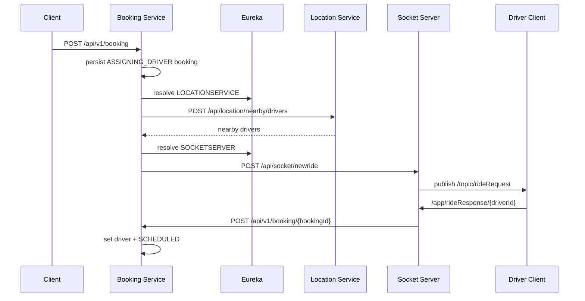

# RideFlow Booking Service

Booking Service is the orchestration service for RideFlow's distributed ride-request flow. It creates bookings, asks Location Service for nearby drivers, asks Socket Server to notify drivers in real time, and updates a booking when a driver is selected.

## Runtime

| Property | Value |
|---|---|
| Application name | `BookingService` |
| Port | `8001` |
| Database | MySQL / `uberdb` |
| Cache configuration | Redis |
| Messaging configuration | Kafka |
| Discovery | Eureka client |
| Inter-service HTTP | Retrofit + OkHttp |
| Shared models | `Rideflow-EntityService:0.0.5-SNAPSHOT` |

## Booking Flow



## API

Base path:

```text
/api/v1/booking
```

### Create Booking

```http
POST /api/v1/booking
Content-Type: application/json
```

Example:

```json
{
  "passengerId": 1,
  "startLocation": {
    "latitude": 17.3850,
    "longitude": 78.4867
  },
  "endLocation": {
    "latitude": 17.4401,
    "longitude": 78.3489
  }
}
```

The current implementation initially persists the booking with:

```text
ASSIGNING_DRIVER
```

Example response shape:

```json
{
  "bookingId": 19,
  "bookingStatus": "ASSIGNING_DRIVER"
}
```

After persistence, nearby-driver lookup and ride-request broadcasting are performed asynchronously through Retrofit callbacks.

### Assign/Update Booking

```http
POST /api/v1/booking/{bookingId}
Content-Type: application/json
```

Example:

```json
{
  "status": "SCHEDULED",
  "driverId": 1
}
```

Current service behavior assigns the supplied driver and explicitly updates the booking to:

```text
SCHEDULED
```

The implementation currently does not use the request's `status` field to choose another state.

## Inter-Service Clients

### Location Service

Retrofit contract:

```text
POST /api/location/nearby/drivers
```

Eureka lookup:

```text
LOCATIONSERVICE
```

### Socket Server

Retrofit contract:

```text
POST /api/socket/newride
```

Eureka lookup:

```text
SOCKETSERVER
```

This means Service Discovery, Location Service and Socket Server must be available when exercising the complete booking flow.

## Tech Stack

- Java 17
- Spring Boot 4.1.1
- Spring MVC
- Spring Data JPA / Hibernate
- MySQL
- Spring Data Redis
- Apache Kafka
- Spring WebSocket dependency
- Spring Cloud Netflix Eureka Client
- Retrofit 2 / OkHttp
- Gson converter
- Lombok
- Gradle
- shared RideFlow EntityService models

## Configuration

### Application

```properties
spring.application.name=BookingService
server.port=8001
```

### MySQL

```properties
spring.datasource.url=jdbc:mysql://localhost:3306/uberdb
spring.datasource.username=root
spring.datasource.password=root
spring.jpa.hibernate.ddl-auto=update
```

### Redis

```properties
spring.data.redis.host=localhost
spring.data.redis.port=6379
```

### Kafka

```properties
spring.kafka.bootstrap-servers=localhost:9092
spring.kafka.consumer.group-id=sample-group-2
spring.kafka.consumer.auto-offset-reset=earliest
```

### Eureka

```properties
eureka.client.service-url.defaultZone=http://localhost:8761/eureka
eureka.instance.preferIpAddress=true
```

## Prerequisites

- JDK 17+
- MySQL with database `uberdb`
- Redis
- Kafka
- Service Discovery
- Location Service
- Socket Server
- `Rideflow-EntityService:0.0.5-SNAPSHOT` in Maven Local

## Suggested Startup Order

For this service's full flow:

1. MySQL
2. Redis
3. Kafka
4. publish EntityService
5. Service Discovery
6. Location Service
7. Socket Server
8. Booking Service

## Run

```bash
# Linux/macOS
./gradlew bootRun

# Windows
gradlew.bat bootRun
```

Build/test:

```bash
./gradlew clean build
./gradlew test
```

## Project Structure

```text
src/main/java/com/rideflow/bookingservice/
├── BookingServiceApplication.java
├── api/
│   ├── LocationServiceApi.java
│   └── SocketApi.java
├── configuration/
│   ├── KafkaConfig.java
│   └── RetrofitConfig.java
├── controllers/
│   └── BookingController.java
├── dto/
├── repository/
└── service/
    ├── BookingService.java
    └── BookingServiceImpl.java
```

## Current Implementation Notes

- Booking creation calls `passengerRepository.findById(...).get()`, so an unknown passenger currently needs stronger error handling.
- The nearby-driver HTTP request is asynchronous.
- A successful nearby-driver lookup triggers the Socket Server request.
- Driver assignment currently sets the booking status to `SCHEDULED`.
- Driver availability updates are marked as TODOs in the current service implementation.
- The service resolves Location and Socket URLs through Eureka at bean creation time.
- Redis and Kafka are configured in the service, though the central `BookingServiceImpl` flow shown above is primarily JPA + Retrofit based.
- Springdoc/OpenAPI is not currently configured.

## Parent Project

[RideFlow](https://github.com/Abhilash-Panja/RideFlow)
